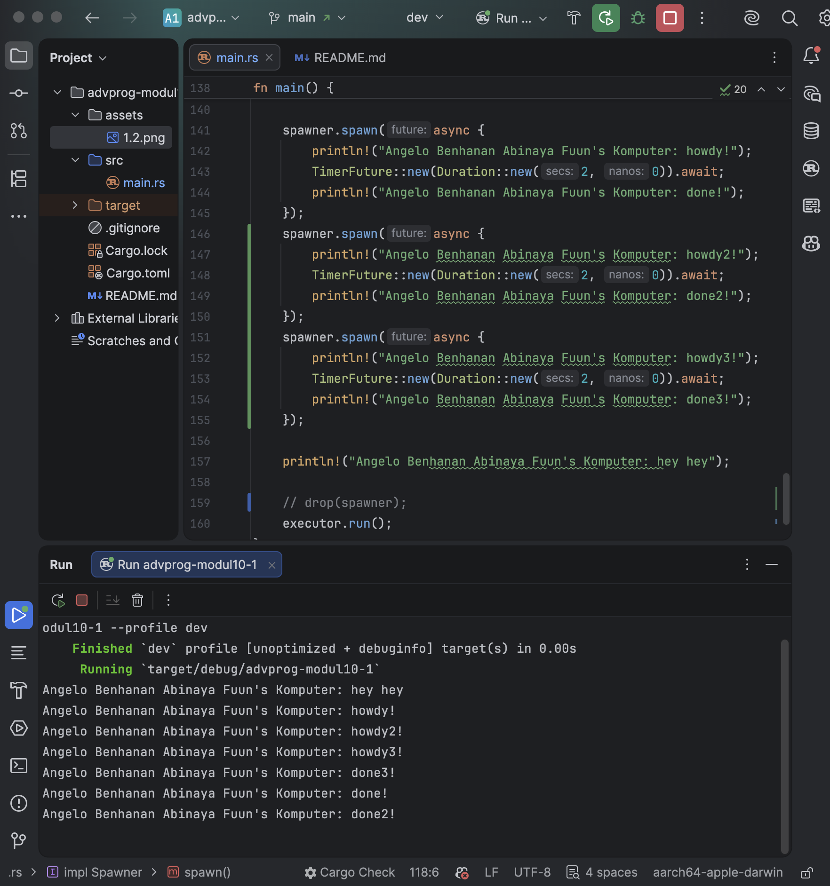

### 1.2 Understanding How It Works

Output:

spawner.spawn only queues the async task, it doesn't run it yet. 
The async block doesn't execute until executor.run() is called so "hey hey" prints immediately on the main thread before the executor ever starts polling the future.

### 1.3 Multiple Spawn & Removing Drop

Output:

All 3 tasks run concurrently; "howdy" lines print first, followed by the "done" lines.
By removing drop(spawner), the program will hang forever. 
Without it, the executor can't know there are no more tasks coming, so it blocks indefinitely on recv().

