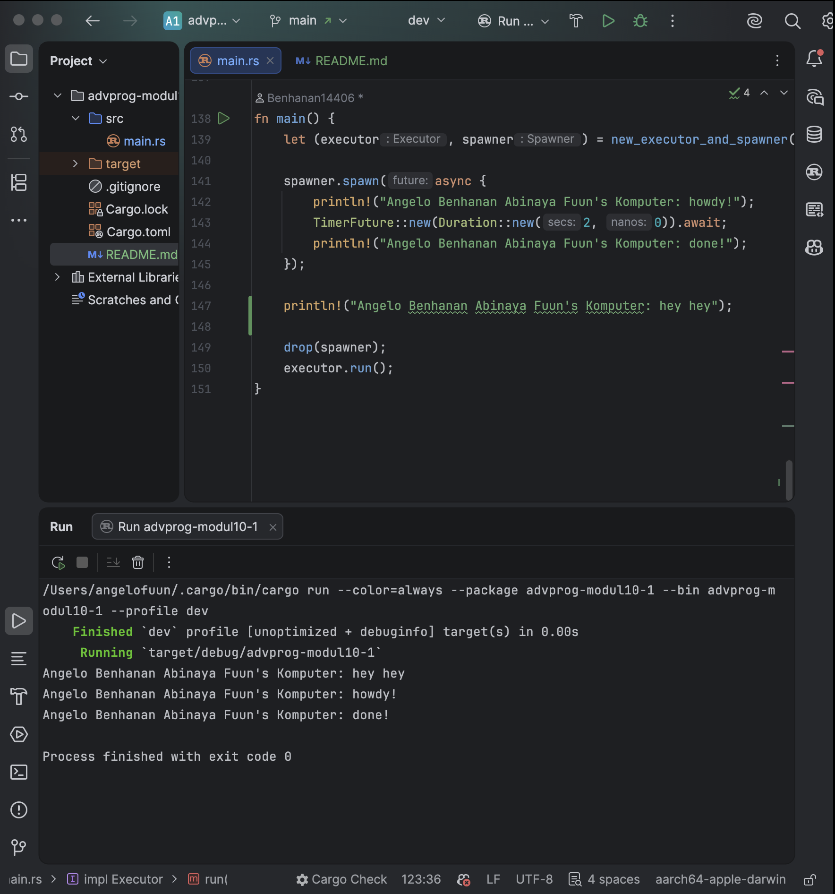

### 1.2 Understanding How It Works

Output:

spawner.spawn only queues the async task, it doesn't run it yet. The async block doesn't execute until executor.run() is called. So "hey hey" prints immediately on the main thread before the executor ever starts polling the future

